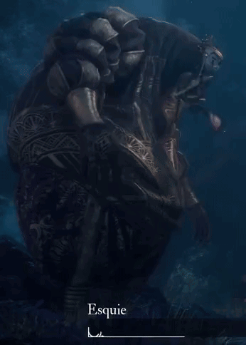

<!-- ============================================================
  Izemmouren Ilyes — GitHub Profile
  Theme: Clair Obscur · Expedition 33 · Belle Époque Noir
  ============================================================ -->

<!-- BANNER -->

  

 

  
  

<!-- ABOUT ME --------------------------------------------->

<table align="center">
  <tr>
    <td width="35%" align="center" valign="middle">
      
    </td>
    <td width="65%" valign="middle">
    <strong>Hey there! I'm Izemmouren Ilyes 👾</strong>  

**I'm an AI & Data Science student building systems that learn from data and solve real-world problems.**  

📖 Currently exploring: Vision Transformers & Object Detection 
🌙 Motto: <i>"stubborn people change the world."</i> 
🎭 Mood: <i><code>"I too am 'Whooo' but I'm also 'Wheee!' So the 'Wheee' balances the 'Whooo!'" — Esquie</code></i>
    </td>
  </tr>
</table>

 

<!-- TECH STACK -->

 

**Languages** *(Yes, I know HTML & CSS aren't programming languages.)*

 

**Frameworks & Tools** *(pandas gets an honorable mention, no logo deserved)*

<!-- CONNECT -->

&nbsp;

&nbsp;

